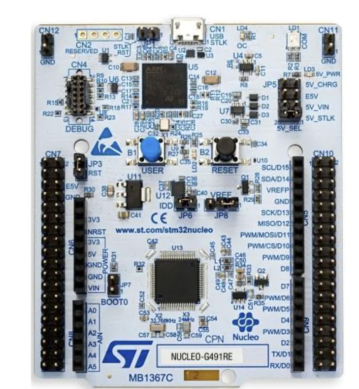
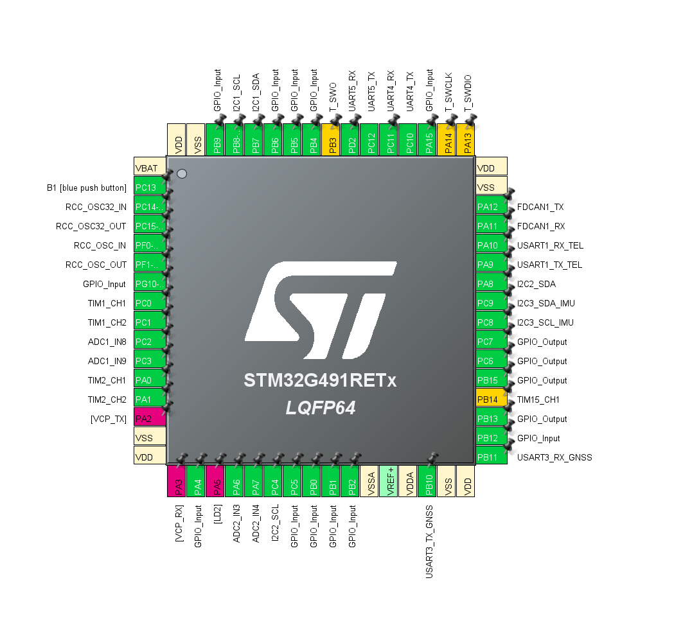
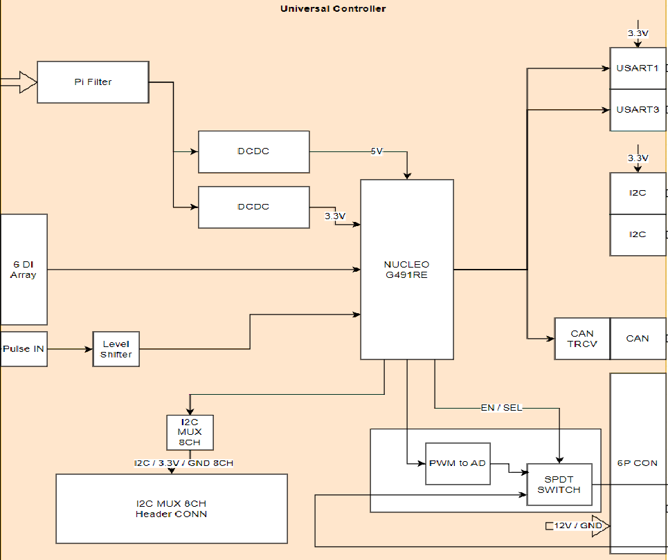

# D2_Vehicle_Controller Repository
 - D2 Vehicle Main Controller
 - Project name : wsc2025_Master
### Branch
 - main : release branch
 
### Environment
 - STM32cubeIDE environment
    - version : 1.16.1

# Target Board
 - NUCLEO-G491RE
 - ioc Configuration
 
   
   
 - Daughterboard

   

    - DCDC Converter 5V
      - Convert 12V into 5V
    - DCDC Converter 3V3
      - Convert 12V into 3.3V
    - Pulse in and level shifter
      - Translate Voltage level (of 5V) to 3.3V
    - CAN Transceiver
      - Transmitt and Receive CAN Message from CAN BUS
    - PWM to AD
      - Converte PWM (Duty scale of 0% to 100%) to DC Level(scale of 0V to 5V respectively)
    - SPDT switch
      - Select signal to be delivered to Motor Accel
    - I2C
      - IMU , Dotmatrix LCD, etcs
    - UART1
      - GNSS 
    - UART4
      - Telemetry

### Peripheral Setup
  - Those are subject to be changed (since it has not been configured as per Datasheet of each peri and actual use case)
  - Update Configuration according to the feature you are developing
    - Timer (for Pulse counter, PWM outpuit)
    - ADC (to read ADC level)
    - PLL (In case you need to adjust pre-scaler for any frequency components, please ask for update...)
    - CAN (Intiallly it has been set to 500kBPS, nominal pre-scaler : 68, Clock devided by 1)
    - GPIO (PU, PD, DriveStrength to be configured)
    - UART (Mode : Async, Baudrate, WordLength, Parity, StopBit)
    - I2C Setup (Mode : I2C, I2C Speed Frequency)
    - ...

# State

# Tasks
 - Task
   - Routine
 
# Vehicle Database

# HW-Sw Interfaces
- NUCLEO-G491RE Integration
    - Feature to be tested
        - SPDT Switch
        - PWM Output
        - Pulse Input
        - 12V Digital Logic Input
        - UART 2 CH
        - I2C 2CH
        - CAN Transceiver

- Pin List
    - CRUISE
        - **SpeedPulseIn : PC0_TIM1_CH1**
            - Input Capture, Rising Edge
            - AHB1 PLL Freq : 170MHz
            - Prescaler : 16999
            - Counter Period : 65535
            - Timer frequencty : 10kHz = 170MHz / (16999+1) = 10kHz
            - overvlow time : Period +1 / Timer frequency = 6.5536 (sec)
        
        - ~~PWMOUT : **PA0_TIM2_CH1_OUT (재작업 완료)**~~
        - **PWMOUT : PA1_TIM2_CH2**
            - PWM output frequency : 200Hz
                - AHB1 PLL FRequ : 170MHz
                - PWM Freq = (Timer Clock) / ((Prescaler +1) * (Period + 1))
                - Prescaler = 1699
                - Period = 4999
        
        - **MUX SWITCH EN  : PB15_GPO**
            - HIgh : Enable
            - Low :  Disable
        - **MUX SWITCH SEL : PB13_GPO**
            - High : Cruse DC Out
            - Low : Accel Pedal Out
            
        - **CRUISE MODE SW IN : PC6_GPI (DIN1)**
            - High : Pushed
            - Low : Not Pushed
        - **SPD UP SW IN : PA15_GPI (DIN2)**
            - High : Pushed
            - Low : Not Pushed
        - **SPD DN SW IN : PA4_GPI (DIN3)**
            - High : Pushed
            - Low : Not Pushed
        
        
        
- Telemetry
    - PA9_USART1_TX   (MCU TX, Telemetry RX)
    - PA10_USART1_RX (MCU RX, Telemetry TX)
- GNSS
    - PB10_USART3_TX (MCU TX, GNSS RX)
    - PB11_USART3_RX (MCU RX, GNSS TX)
- IMU Sensor
    - PA8_I2C2_SDA
    - PC4_I2C2_SCL
- CAN Transceiver
    - PA11_FXCAN1_RX
    - PA12_FDCAN1_TX

- PWM to DC Converter
    - LTC2645 (ADI)
    - Frequency Range
        - **100kHz to 30Hz** 

# Version History

